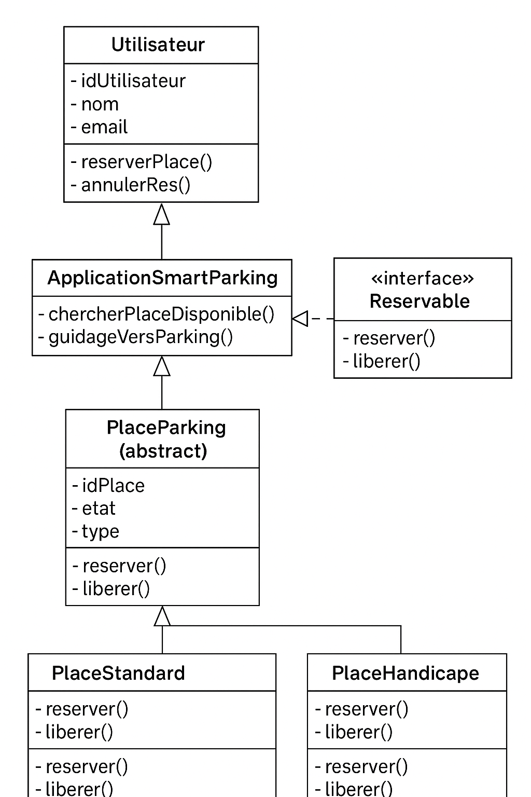

#loubna Ait-Hra
#projet : Application de Gestion Intelligente du Stationnement Urbain

Description du diagramme de classes – Système SmartParking

Le diagramme présenté modélise l’architecture logicielle d’une application de gestion de parking intelligent, appelée SmartParking. Il met en évidence les principales entités du système, leurs responsabilités ainsi que les relations entre elles.
1. Classe Utilisateur
La classe Utilisateur représente toute personne utilisant l’application pour réserver une place de parking.
Elle contient les attributs suivants :
idUtilisateur : identifiant unique de l’utilisateur
nom : nom de l’utilisateur
email : adresse électronique de contact
Les opérations associées permettent :
reserverPlace() : demander la réservation d’une place
annulerRes() : annuler une réservation en cours

L'utilisateur interagit directement avec l’application SmartParking.

2. Classe ApplicationSmartParking

Cette classe constitue le cœur du système. Elle gère la recherche de places disponibles et l’assistance au guidage.
Elle possède deux méthodes principales :

chercherPlaceDisponible() : identifie une place libre correspondant aux besoins de l’utilisateur

guidageVersParking() : fournit un itinéraire vers la place réservée

L’application dépend des classes de type PlaceParking pour accéder à l’état des places et réaliser les réservations.

3. Interface Reservable
L’interface Reservable définit le comportement que doivent respecter toutes les places de parking pouvant être réservées.
Elle impose deux méthodes :
reserver() : occuper la place
liberer() : rendre la place disponible
Toutes les classes de places de parking implémentent cette interface.

4. Classe abstraite PlaceParking
La classe PlaceParking est une classe abstraite représentant un emplacement de parking générique.
Elle comprend les attributs suivants :
idPlace : identifiant unique de la place
etat : état actuel (libre, occupée, réservée…)
type : nature de la place (standard, handicapé…)
Cette classe déclare également les méthodes :
reserver()
liberer()
Les classes concrètes de places de parking héritent de cette abstraction et redéfinissent ces méthodes selon leur type.
5. Classes PlaceStandard et PlaceHandicape
Ces deux classes spécialisent la classe abstraite PlaceParking.
PlaceStandard
Représente une place de parking classique.
Elle implémente les opérations :
reserver()
liberer()

PlaceHandicape
Représente une place destinée aux personnes à mobilité réduite.
Elle propose également les méthodes :
reserver()
liberer()
souvent avec des règles spécifiques (contrôle du droit d’accès, disponibilité prioritaire, etc.).

liberer()
souvent avec des règles spécifiques (contrôle du droit d’accès, disponibilité prioritaire, etc.).
